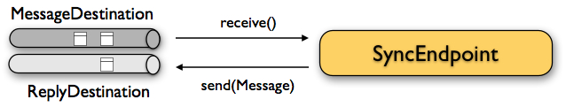

## JMS support

Citrus provides support for sending and receiving JMS messages. We have to separate between synchronous and asynchronous communication. So in this chapter we explain how to setup JMS message endpoints for synchronous and asynchronous outbound and inbound communication

**Note**
The JMS components in Citrus are kept in a separate Maven module. If not already done so you have to include the module as Maven dependency to your project

```xml
<dependency>
  <groupId>com.consol.citrus</groupId>
  <artifactId>citrus-jms</artifactId>
  <version>2.7.2-SNAPSHOT</version>
</dependency>
```

Citrus provides a "citrus-jms" configuration namespace and schema definition for JMS related components and features. Include this namespace into your Spring configuration in order to use the Citrus JMS configuration elements. The namespace URI and schema location are added to the Spring configuration XML file as follows.

```xml
<beans xmlns="http://www.springframework.org/schema/beans"
       xmlns:xsi="http://www.w3.org/2001/XMLSchema-instance"
       xmlns:citrus-jms="http://www.citrusframework.org/schema/jms/config"
       xsi:schemaLocation="
       http://www.springframework.org/schema/beans 
       http://www.springframework.org/schema/beans/spring-beans.xsd
       http://www.citrusframework.org/schema/jms/config
       http://www.citrusframework.org/schema/jms/config/citrus-jms-config.xsd">
       
    [...]
    
</beans>
```

After that you are able to use customized Citrus XML elements in order to define the Spring beans.

### JMS endpoints

By default Citrus JMS endpoints are asynchronous. So let us first of all deal with asynchronous messaging which means that we will not wait for any response message after sending or receiving a message.

The test case itself should not know about JMS transport details like queue names or connection credentials. This information is stored in the endpoint component configuration that lives in the basic Spring configuration file in Citrus. So let us have a look at a simple JMS message endpoint configuration in Citrus.

```xml
<citrus-jms:endpoint id="helloServiceQueueEndpoint"
          destination-name="Citrus.HelloService.Request.Queue"
          timeout="10000"/>
```

The endpoint component receives an unique id and a JMS destination name. This can be a queue or topic destination. We will deal with JMS topics later on. For now the timeout setting completes our first JMS endpoint component definition.

The endpoint needs a JMS connection factory for connecting to a JMS message broker. The connection factory is also added as Spring bean to the Citrus Spring application context.

```xml
<bean id="connectionFactory" 
         class="org.apache.activemq.ActiveMQConnectionFactory">
    <property name="brokerURL" value="tcp://localhost:61616" />
</bean>
```

The JMS connection factory receives the JMS message broker URL and is able to hold many other connection specific options. In this example we use the Apache ActiveMQ connection factory implementation as we want to use the ActiveMQ message broker. Citrus works by default with a bean id **connectionFactory** . All Citrus JMS component will automatically recognize this connection factory.

**Tip**
Spring makes it very easy to connect to other JMS broker implementations too (e.g. Apache ActiveMQ, TIBCO Enterprise Messaging Service, IBM Websphere MQ). Just add the required connection factory implementation as **connectionFactory** bean.

**Note**
All of the Citrus JMS endpoint components will automatically look for a bean named **connectionFactory** by default. You can use the **connection-factory** endpoint attribute in order to use another connection factory instance with different bean names.

```xml
<citrus-jms:endpoint id="helloServiceQueueEndpoint"
      destination-name="Citrus.HelloService.Request.Queue"
      connection-factory="myConnectionFacotry"/>
```

As an alternative to that you may want to use a special Spring jms template implementation as custom bean in your endpoint.

```xml
<citrus-jms:endpoint id="helloServiceQueueEndpoint"
              destination-name="Citrus.HelloService.Request.Queue"
              jms-template="myJmsTemplate"/>
```

The endpoint is now ready to be used inside a test case. Inside a test case you can send or receive messages using this endpoint. The test actions can reference the JMS endpoint using its identifier. When sending a message the message endpoint creates a JMS message producer and will simply publish the message to the defined JMS destination. As the communication is asynchronous by default producer does not wait for a synchronous response.

When receiving a messages with this endpoint the endpoint creates a JMS consumer on the JMS destination. The endpoint then acts as a message driven listener. This means that the message consumer connects to the given destination and waits for messages to arrive.

**Note**
Besides the destination-name attribute you can also provide a reference to a destination implementation.

```xml
<citrus-jms:endpoint id="helloServiceQueueEndpoint"
                                destination="helloServiceQueue"/>

<amq:queue id="helloServiceQueue" physicalName="Citrus.HelloService.Request.Queue"/>
```

The destination attribute references to a JMS destination object in the Spring application context. In the example above we used the ActiveMQ queue destination component. The destination reference can also refer to a JNDI lookup for instance.

### JMS synchronous endpoints

When using synchronous message endpoints Citrus will manage a reply destination for receiving a synchronous response message on the reply destination. The following figure illustrates that we now have two destinations in our communication scenario.


The synchronous message endpoint component is similar to the asynchronous brother that we have discussed before. The only difference is that the endpoint will automatically manage a reply destination behind the scenes. By default Citrus uses temporary reply destinations that get automatically deleted after the communication handshake is done. Again we need to use a JMS connection factory in the Spring XML configuration as the component need to connect to a JMS message broker.

```xml
<citrus-jms:sync-endpoint id="helloServiceSyncEndpoint"
          destination-name="Citrus.HelloService.InOut.Queue"
          timeout="10000"/>
```

The synchronous component defines a target destination which again is either a queue or topic destination. If nothing else is defined the endpoint will create temporary reply destinations on its own. When the endpoint has sent a message it waits synchronously for the response message to arrive on the reply destination. You can receive this reply message in your test case by referencing this same endooint in a receive test action. In case no reply message arrives in time a message timeout error is raised respectively.

See the following example test case which references the synchronous message endpoint in its send and receive test action in order to send out a message and wait for the synchronous response.

```xml
<testcase name="synchronousMessagingTest">
    <actions>
        <send endpoint="helloServiceSyncEndpoint">
            <message>
                <data>
                  [...]
                </data>
            </message>
        </send>
        
        <receive endpoint="helloServiceSyncEndpoint">
            <message>
                <data>
                  [...]
                </data>
            </message>
        </receive>
    </actions>
</testcase>
```

We initiated the synchronous communication by sending a message on the synchronous endpoint. The second step then receives the synchronous message on the temporary reply destination that was automatically created for us.

If you rather want to define a static reply destination you can do so, too. The static reply destination is not deleted after communication handshake. You may need to work with message selectors then in order to pick the right response message that belongs to a specific communication handshake. You can define a static reply destination on the synchronous endpoint component as follows.

```xml
<citrus-jms:sync-endpoint id="helloServiceSyncEndpoint"
          destination-name="Citrus.HelloService.InOut.Queue"
          reply-destination-name="Citrus.HelloService.Reply.Queue"
          timeout="10000"/>
```

Instead of using the **reply-destination-name** feel free to use the destination reference with **reply-destination** attribute. Again you can use a JNDI lookup then to reference a destination object.

**Important**
Be aware of permissions that are mandatory for creating temporary destinations. Citrus tries to create temporary queues on the JMS message broker. Following from that the Citrus JMS user has to have the permission to do so. Be sure that the user has the sufficient rights when using temporary reply destinations.

Up to now we have sent a message and waited for a synchronous response in the next step. Now it is also possible to switch the directions of send and receive actions. Then we have the situation where Citrus receives a JMS message first and then Citrus is in charge of providing a proper synchronous response message to the initial sender.



In this scenario the foreign message producer has stored a dynamic JMS reply queue destination to the JMS header. So Citrus has to send the reply message to this specific reply destination, which is dynamic of course. Fortunately the heavy lift is done with the JMS message endpoint and we do not have to change anything in our configuration. Again we just define a synchronous message endpoint in the application context.

```xml
<citrus-jms:sync-endpoint id="helloServiceSyncEndpoint"
      destination-name="Citrus.HelloService.InOut.Queue"
      timeout="10000"/>
```

Now the only thing that changes here is that we first receive a message in our test case on this endpoint. The second step is a send message action that references this same endpoint and we are done. Citrus automatically manages the reply destinations for us.

```xml
<testcase name="synchronousMessagingTest">
  <actions>
        <receive endpoint="helloServiceSyncEndpoint">
            <message>
                <data>
                  [...]
                </data>
            </message>
        </receive>

        <send endpoint="helloServiceSyncEndpoint">
            <message>
                <data>
                  [...]
                </data>
            </message>
        </send>
    </actions>
</testcase>
```

### JMS topics

Up to now we have used JMS queue destinations on our endpoints. Citrus is also able to connect to JMS topic destinations. In contrary to JMS queues which represents the **point-to-point** communication JMS topics use **publish-subscribe** mechanism in order to spread messages over JMS. A JMS topic producer publishes messages to the topic, while the topic accepts multiple message subscriptions and delivers the message to all subscribers.

The Citrus JMS endpoints offer the attribute **'pub-sub-domain'** . Once this attribute is set to **true** Citrus will use JMS topics instead of queue destinations. See the following example where the publish-subscribe attribute is set to true in JMS message endpoint components.

```xml
<citrus-jms:endpoint id="helloServiceQueueEndpoint"
            destination="helloServiceQueue"
            pub-sub-domain="true"/>
```

When using JMS topics you will be able to subscribe several test actions to the topic destination and receive a message multiple times as all subscribers will receive the message.

**Important**
It is very important to keep in mind that Citrus does not deal with durable subscribers. This means that messages that were sent in advance to the message subscription are not delivered to the message endpoint. So racing conditions may cause problems when using JMS topic endpoints in Citrus. Be sure to let Citrus subscribe to the topic before messages are sent to it. Otherwise you may loose some messages that were sent in advance to the subscription.

### JMS message headers

The JMS specification defines a set of special message header entries that can go into your JMS message. These JMS headers are stored differently in a JMS message header than other custom header entries do. Therefore these special header values should be set in a special syntax that we discuss in the next paragraphs.

```xml
<header>
    <element name="citrus_jms_correlationId" value="${correlationId}"/>
    <element name="citrus_jms_messageId" value="${messageId}"/>
    <element name="citrus_jms_redelivered" value="${redelivered}"/>
    <element name="citrus_jms_timestamp" value="${timestamp}"/>
</header>
```

As you see all JMS specific message headers use the **citrus_jms_** prefix. This prefix comes from Spring Integration message header mappers that take care of setting those headers in the JMS message header properly.

Typing of message header entries may also be of interest in order to meet the JMS standards of typed message headers. For instance the following message header is of type double and is therefore transferred via JMS as a double value.

```xml
<header>
    <element name="amount" value="19.75" type="double"/>
</header>
```

### SOAP over JMS

When sending SOAP messages you have to deal with proper envelope, body and header construction. In Citrus you can add a special message converter that performs the heavy lift for you. Just add the message converter to the JMS endpoint as shown in the next program listing:

```xml
<citrus-jms:endpoint id="helloServiceSoapJmsEndpoint"
        destination-name="Citrus.HelloService.Request.Queue"
        message-converter="soapJmsMessageConverter"/>

<bean id="soapJmsMessageConverter" class="com.consol.citrus.jms.message.SoapJmsMessageConverter"/>
```

With this message converter you can skip the SOAP envelope completely in your test case. You just deal with the message body payload and the header entries. The rest is done by the message converter. So you get proper SOAP messages on the producer and consumer side.

